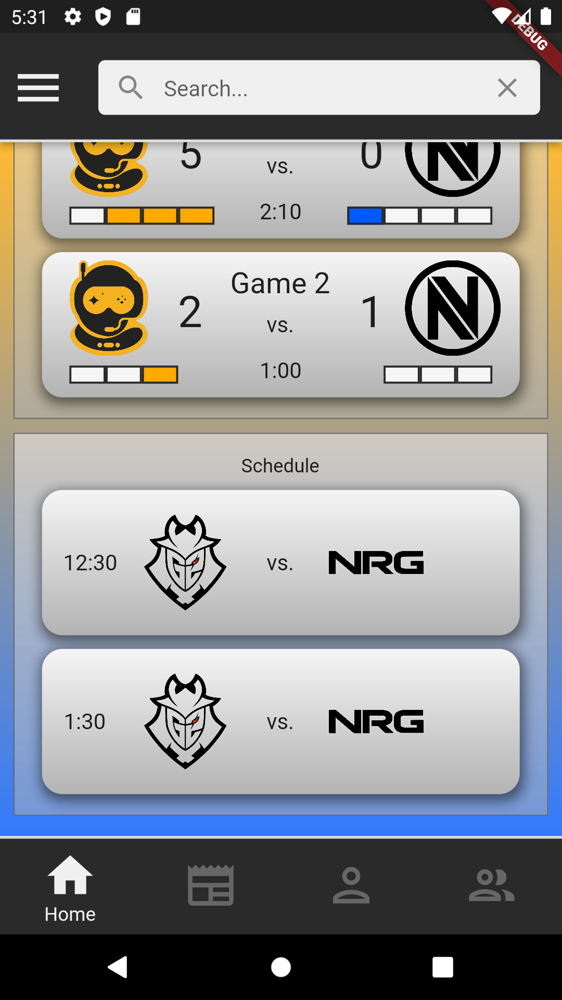
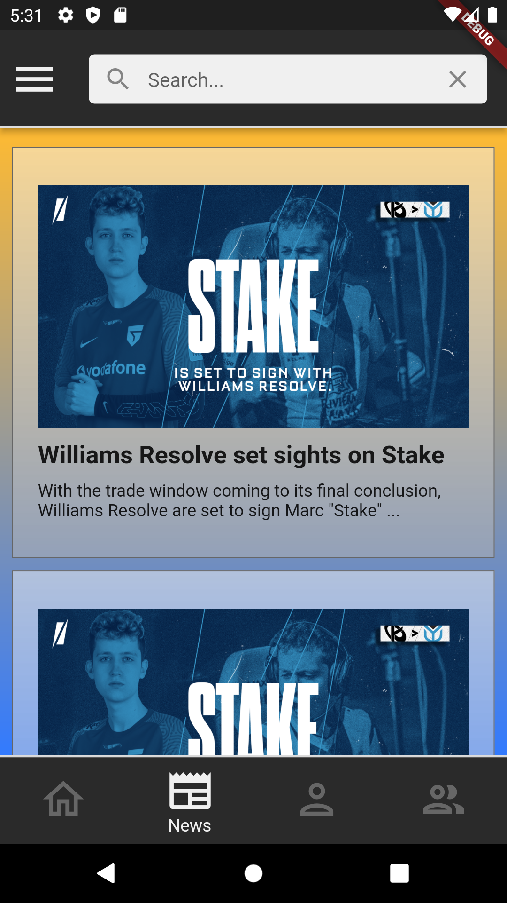
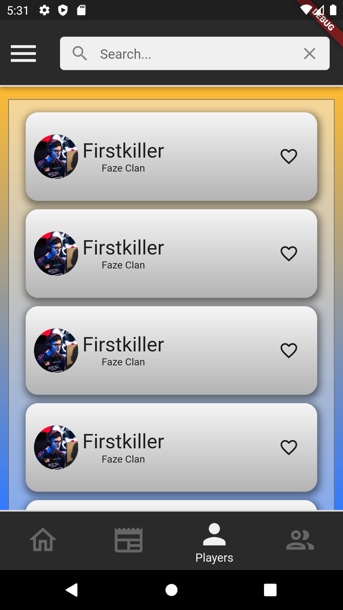
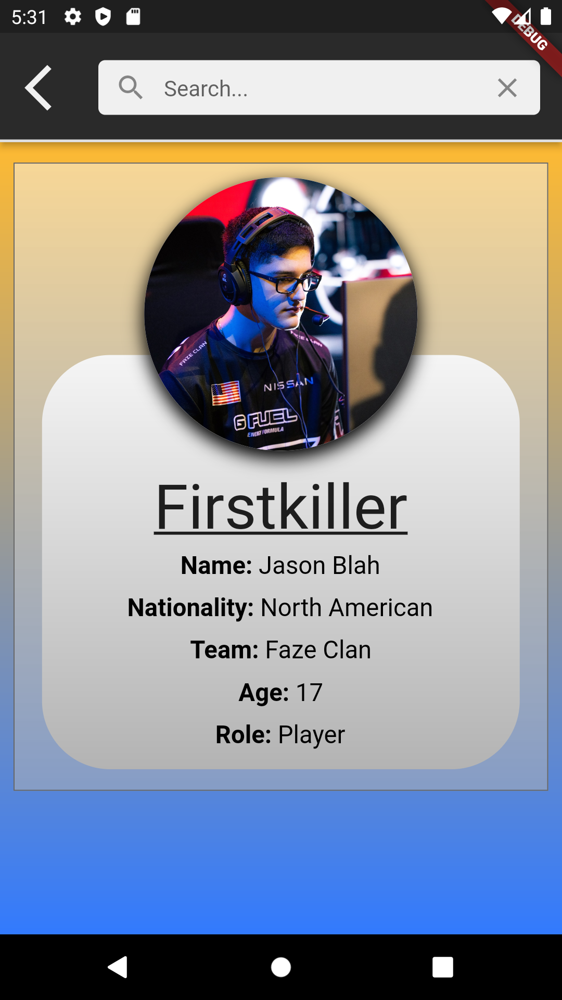
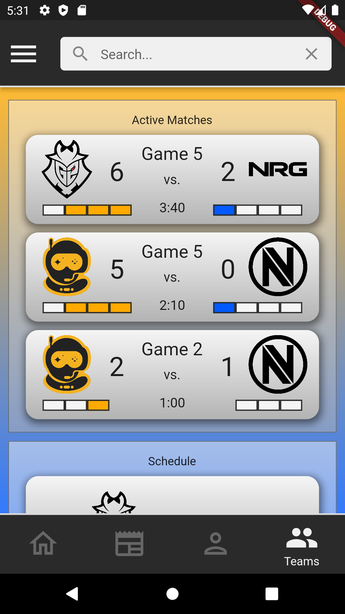

# Table of Contents
- [Table of Contents](#table-of-contents)
- [Rocket League eSports Mobile App](#rocket-league-esports-mobile-app)
- [Status](#status)
- [Planned features](#planned-features)
- [Design](#design)
- [Development Screenshots](#development-screenshots)
  - [Home page](#home-page)
  - [News feed](#news-feed)
  - [Players Page](#players-page)
  - [Teams Page](#teams-page)

# Rocket League eSports Mobile App
A flutter mobile app for Rocket League eSports. The idea of this was to be able 
to see live scores without having to load up the live stream via twitch or 
youtube. I also wanted to be able to follow specific teams and/or players and 
tailor a news feed to be more relevant to me.

# Status

# Planned features
See the [features](./docs/features.md) doc on the ideas and implementation plans 
I had when starting the app. The most important feature of this is the 
live scores viewing.

# Design
See the [pages.drawio](./docs/pages.drawio) file in the docs dir for a 
[draw.io](draw.io) diagram of the original design. It morphed a little over the 
time in development without fully updating the drawio file.

# Development Screenshots
## Home page
The home page was meant to be the first page that loads when you open the app with
the first thing you see is the currently active matches. This section would
tell you everything about the match you need right away including:
- who was playing
- which game it was
- time left in the current game
- score of the game
- the set score for each team

Currently, all of the data on the page is hardcoded using dummy data. This
section will be the most challenging of the whole app and is the reason I'm gonna
step away from it for a bit. I don't think there are any APIs out there that are
currently tracking live scores so I believe this would require me to create a stream
scraper and API for it.

  

After the active matches list was a schedule of upcoming matches. This listed
details of the matches including the time it was scheduled (was to be local time) 
and who was playing.

  

## News feed
The news feed page is meant to be a page that scraped Rocket League eSports news
pages like [Shift](https://www.shiftrle.gg/) or Reddit. I wanted to add a way to 
filter this to the user's favorite players and teams but also sprinkle in some 
extras here and there unrelated. Each article would open a browser to the URL of
the article.

  

## Players Page
This page starts as a list of all the players in the game. You could favorite a
player quickly from here. It would also display the team the player is on.

  

If you tap on one of the players, you could see more details about them

  

## Teams Page
I haven't gotten to the teams page yet but it would look similar to the players
page with a list of teams. Tapping one would take you to the teams detailed page.
That page would include details about the team such as who was on it, average stats
over the season, and a match history.

Currently it looks like the home page but with the teams menu option selected

  

